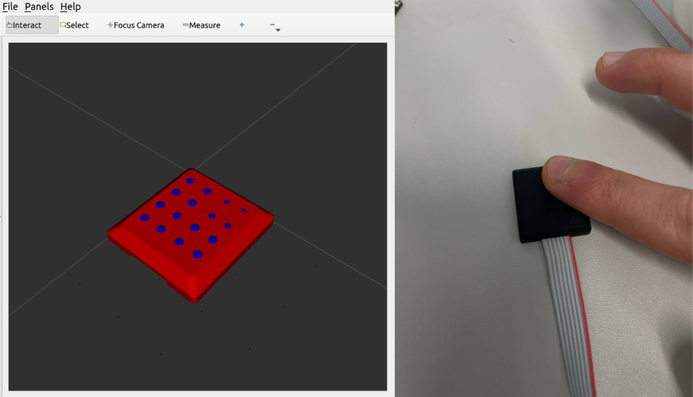
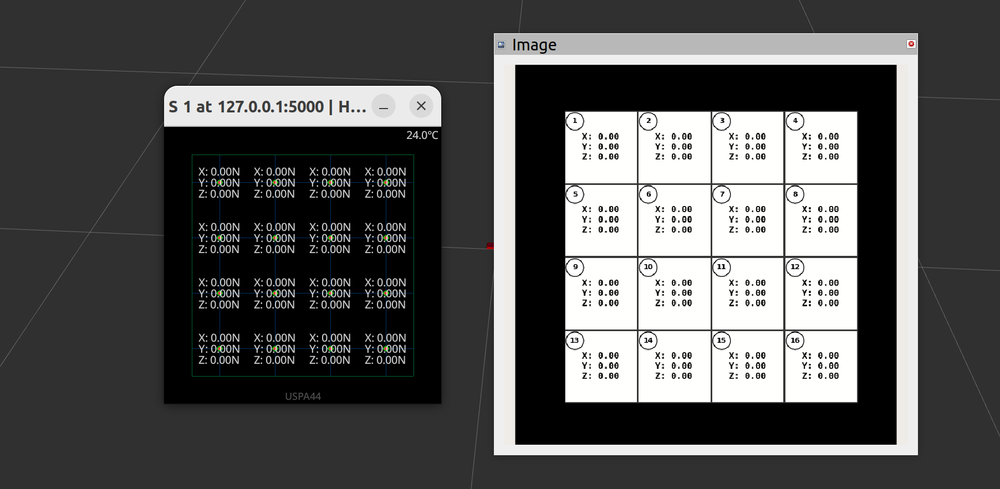

# ROS 2 URDF Models for XELA Sensors

This repository is a fork of the original [xela_models](https://github.com/mcsix/xela_models) package. It has been fully migrated and updated for **ROS 2**, featuring a modernized package structure, updated launch files, and the addition of two custom nodes designed for enhanced visualization and digital twin integration:

### Xela Joint Bridge
This node is designed to work in tandem with the physical hardware and an active instance of the [Xela ROS 2 Server](https://github.com/mcsix/xela_server_ros2.git). 

When launched, it acts as a real-time bridge between the raw sensor data and the URDF joint states in RViz. Specifically, it maps the physical displacement of the internal magnets to the corresponding "blue dot" taxels (prismatic/continuous joints) on the uSP44 sensor 3D model. This creates a fully responsive Digital Twin, where the virtual mesh dynamically reacts to the forces applied to the real sensor.

  

### Xela Image Viz
This node generates a 2D heatmap dashboard of the sensor uSP44 closely resembling the official `xela_viz` GUI—but operates entirely natively within the ROS 2 ecosystem. 

Instead of opening a standalone pop-up window, it subscribes to the sensor data published by the server, renders the 2D grid in the background, and continuously publishes the resulting frames as a standard `sensor_msgs/Image` topic. This allows users to seamlessly embed the 2D dashboard directly inside RViz using an Image Display panel. 

It proves to be particularly useful during offline data playback and visualization, situations where the official Xela scripts cannot be easily executed.

  

